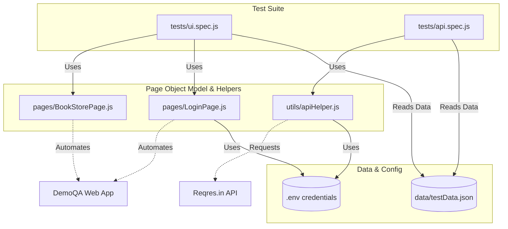
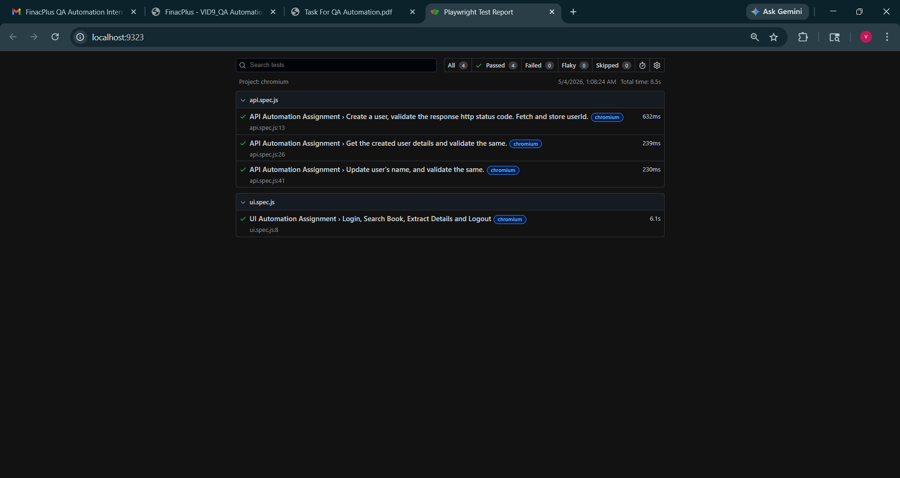
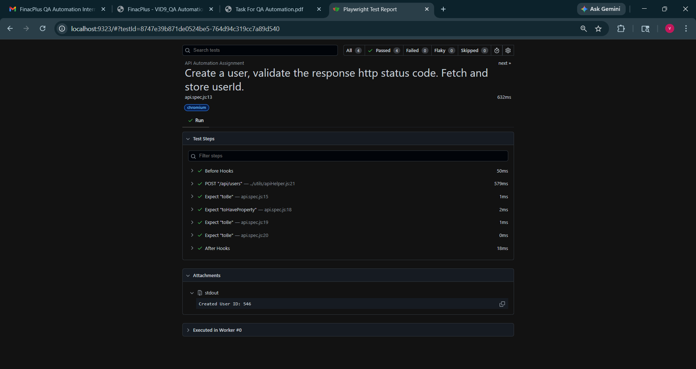
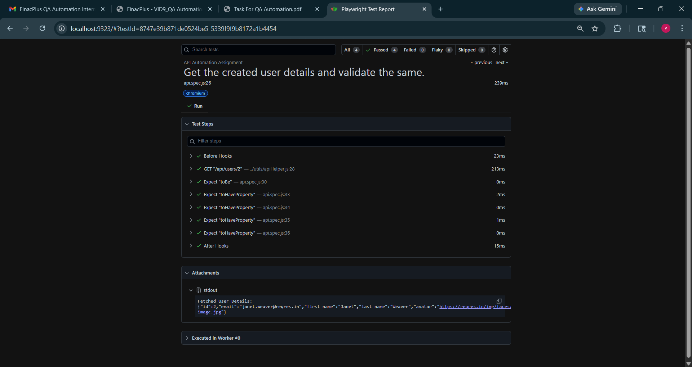
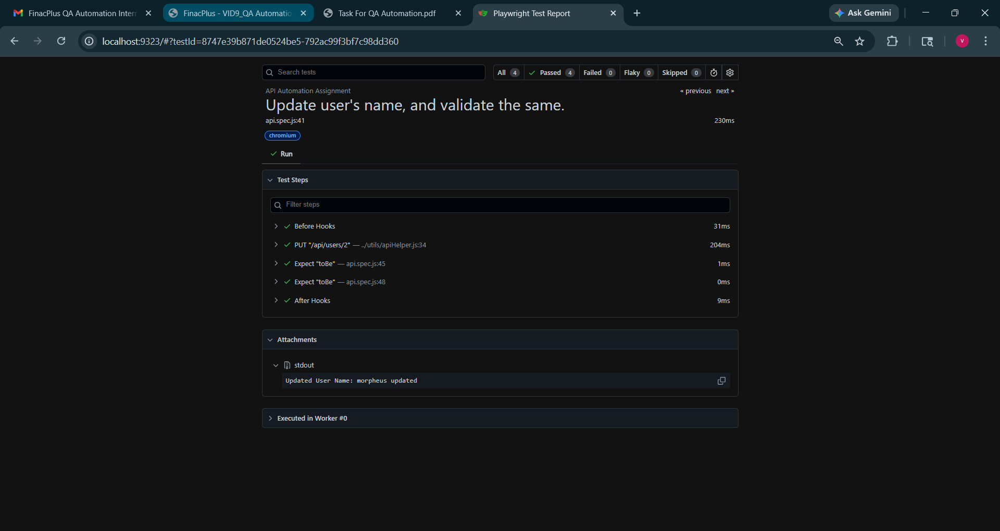
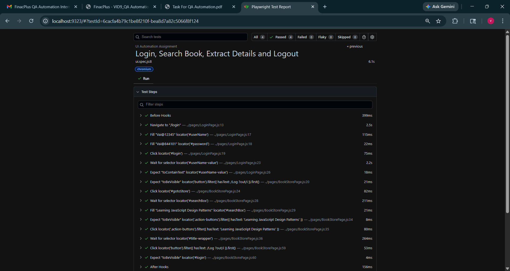

# QA Automation Assignment

This repository contains the complete automated test suite for the QA Assignment covering both UI and API automation using Playwright with JavaScript.

## 🛠 Tech Stack
- **Framework**: [Playwright](https://playwright.dev/)
- **Language**: JavaScript (Node.js)
- **Environment Management**: `dotenv`

---

## 🏗 Architecture Flowchart



---

## 📋 Prerequisites

Before running the tests, ensure you have the following installed on your machine:
- **Node.js**: (v14 or higher is recommended)
- **npm**: (comes with Node.js)

---

## 🚀 Step-by-Step Setup Instructions

### 1. Install Dependencies
Open your terminal in the root directory of this project and install the necessary npm packages (including Playwright browsers):

```bash
npm install
npx playwright install
```

### 2. Configure Environment Variables
The test suite relies on a `.env` file to securely manage credentials and API keys.

Create a file named `.env` in the root of the project (if it doesn't already exist) and add the following contents:

```env
DEMOQA_USERNAME=your_demoqa_username
DEMOQA_PASSWORD=your_demoqa_password
REQRES_API_KEY=your_reqres_api_key
```

**How to get these credentials:**
- **DemoQA (UI Test)**: Navigate to `https://demoqa.com/register` and manually create a new account (automation is blocked by CAPTCHA). Place your username and password in the `.env` file.
- **Reqres (API Test)**: Navigate to `https://app.reqres.in/`, generate a free API key, and place it in the `.env` file.

---

## 🏃‍♂️ How to Run the Tests

You can run the tests individually or all at once using the custom npm scripts configured in `package.json`.

### Run All Tests
To run both the UI and API tests sequentially:
```bash
npm test
```

### Run Only UI Tests
To run only the Book Store Application UI tests:
```bash
npm run test:ui
```
*Note: Upon successful completion, the script will output the searched book's details (Title, Author, Publisher) into a newly generated `book_details.txt` file.*

### Run Only API Tests
To run only the Reqres API tests:
```bash
npm run test:api
```

---

## 📊 Viewing the Test Report

Playwright automatically generates a detailed HTML report after every test run, capturing metrics, statuses, and screenshots if failures occur.

To view the report, run the following command:
```bash
npm run test:report
```
This will start a local server and automatically open the interactive test report in your default web browser.

### 🏆 Test Execution Screenshots
*(Below is the visual proof of 100% successful test execution for this assignment)*

**Main Test Executions Report Overview:**


**Detailed API & UI Test Executions:**





---

## 📁 Project Structure Overview

- `tests/ui.spec.js`: Contains the UI automation tests, utilizing the Page Object Model for improved readability and maintainability.
- `tests/api.spec.js`: Contains the API automation tests, utilizing the APIHelper class to abstract network requests.
- `pages/LoginPage.js` & `pages/BookStorePage.js`: Page Object classes encapsulating the locators and actions for specific pages.
- `utils/apiHelper.js`: Helper utility for API requests, managing endpoints and headers.
- `data/testData.json`: Externalized test data to keep hardcoded strings out of the test logic.
- `playwright.config.js`: The central configuration file defining the Chromium browser, headless execution, and the HTML reporter.
- `book_details.txt`: Autogenerated upon a successful UI test run, storing the extracted book details.
- `.env`: Environment variables file storing secure credentials (ignored by Git).
- `.gitignore`: Prevents sensitive files and heavy build artifacts from being committed to version control.
